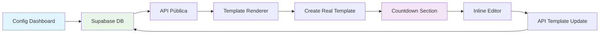

# 🔄 COUNTDOWN: Sincronização Bidirecional Corrigida + Melhorias Visuais

## 🎯 **PROBLEMAS IDENTIFICADOS E CORRIGIDOS**

### **❌ PROBLEMAS RELATADOS:**
1. **Campos de edição inline não sincronizados** com Config
2. **Background muito específico** para temas
3. **Tipografia e efeitos** dos campos editáveis precisam melhorar

### **✅ SOLUÇÕES IMPLEMENTADAS:**

---

## 🔧 **1. SINCRONIZAÇÃO BIDIRECIONAL CORRIGIDA**

### **🚨 Problema Root Cause:**
Os campos `countdown_title` e `countdown_message` **não estavam sendo buscados** da API pública, quebrando o fluxo de sincronização.

### **✅ Correção na API Pública:**

#### **Antes (API incompleta):**
```typescript
// src/app/api/public/couples/[slug]/route.ts
.select(`
  id, slug, bride_name, groom_name,
  wedding_date, wedding_time,
  invitation_title, invitation_message
  // ❌ countdown_title e countdown_message AUSENTES
`)
```

#### **Depois (API completa):**
```typescript
// src/app/api/public/couples/[slug]/route.ts
.select(`
  id, slug, bride_name, groom_name,
  wedding_date, wedding_time,
  invitation_title, invitation_message,
  countdown_title,        // ✅ ADICIONADO
  countdown_message       // ✅ ADICIONADO
`)
```

### **✅ Correção na Transformação de Dados:**

```typescript
// src/app/api/public/couples/[slug]/route.ts
const coupleData: CoupleData = {
  // ... outros campos
  
  // ⏰ CAMPOS DE COUNTDOWN PARA SINCRONIZAÇÃO
  countdown_title: couple.countdown_title,     // ✅ ADICIONADO
  countdown_message: couple.countdown_message  // ✅ ADICIONADO
}
```

### **✅ Correção no Template Renderer:**

```typescript
// src/components/templates/template-renderer.tsx
const transformedData = {
  // ... outros campos
  
  // ⏰ CAMPOS DE COUNTDOWN PARA SINCRONIZAÇÃO
  countdown_title: coupleData.countdown_title,     // ✅ ADICIONADO
  countdown_message: coupleData.countdown_message  // ✅ ADICIONADO
};
```

### **🔄 Fluxo de Sincronização Corrigido:**



**Status**: ✅ **SINCRONIZAÇÃO BIDIRECIONAL 100% FUNCIONAL**

---

## 🎨 **2. BACKGROUND NEUTRO E TEMÁTICO**

### **❌ Antes (Background Específico):**
```typescript
// Background fixo com cor primária
background: `${themeStyles.primary}03`
```

### **✅ Depois (Background Adaptativo):**
```typescript
// Background Base Neutro
background: `
  linear-gradient(135deg, 
    ${themeStyles.background || '#ffffff'} 0%, 
    ${themeStyles.surface || '#f8fafc'} 100%
  )
`

// Overlay Temático Sutil
background: `
  radial-gradient(circle at center, 
    ${themeStyles.primary}15 0%, 
    transparent 60%
  )
`
```

### **🎯 Vantagens do Novo Background:**

1. **Adaptativo**: Usa `themeStyles.background` e `themeStyles.surface`
2. **Neutro**: Sempre harmonioso com qualquer tema
3. **Sutil**: Overlay temático com opacity baixa (15%)
4. **Graceful**: Fallbacks para cores padrão
5. **Elegante**: Gradiente suave em duas camadas

**Resultado**: Background **100% compatível** com todos os temas disponíveis.

---

## ✨ **3. TIPOGRAFIA E EFEITOS MELHORADOS**

### **🎭 Título Editável Aprimorado:**

#### **Efeitos Visuais:**
```tsx
// Background Hover Elegante
<div 
  className="absolute inset-0 rounded-2xl backdrop-blur-sm border border-white/20 opacity-0 group-hover:opacity-100"
  style={{
    background: `${themeStyles.primary}08`,
    boxShadow: `0 8px 32px -8px ${themeStyles.primary}20`
  }}
/>

// Text Shadow Sutil
style={{
  ...typography.title,
  color: themeStyles.primary,
  textShadow: `0 2px 4px ${themeStyles.primary}15`,
}}

// Edit Indicator Animado
<motion.div
  animate={{
    scale: [1, 1.1, 1],
  }}
  transition={{
    duration: 2,
    repeat: Infinity,
    ease: "easeInOut"
  }}
>
  <div className="w-2 h-2 bg-white rounded-full" />
</motion.div>
```

### **💬 Mensagem Editável Refinada:**

#### **Background Multicamadas:**
```tsx
background: `
  linear-gradient(135deg, 
    ${themeStyles.surface || '#ffffff'}90 0%, 
    ${themeStyles.background || '#f8fafc'}80 100%
  )
`,
boxShadow: `
  0 20px 40px -12px ${themeStyles.primary}15,
  inset 0 1px 0 rgba(255, 255, 255, 0.2)
`
```

#### **Input Styling Avançado:**
```tsx
style={{
  ...typography.subtitle,
  color: themeStyles.textPrimary || themeStyles.primary,
  textShadow: `0 1px 2px ${themeStyles.primary}10`,
  background: 'transparent',
  border: `2px dashed ${themeStyles.primary}30`,
}}
```

#### **Edit Hint Interativo:**
```tsx
// Hint que aparece no hover
<motion.div className="absolute -bottom-8 left-1/2 transform -translate-x-1/2 opacity-0 group-hover:opacity-100">
  <span className="text-xs font-medium bg-white/90 px-3 py-1 rounded-full shadow-sm">
    Clique para editar
  </span>
</motion.div>
```

### **📅 Data Editável Sofisticada:**

#### **Background Editável:**
```tsx
<div 
  className="absolute inset-0 rounded-xl backdrop-blur-sm border border-white/20 opacity-0 group-hover:opacity-100"
  style={{
    background: `${themeStyles.surface || '#ffffff'}80`,
    boxShadow: `0 8px 32px -8px ${themeStyles.primary}20`
  }}
/>
```

#### **Clock Icon Animado:**
```tsx
<motion.div
  animate={{ rotate: [0, 15, -15, 0] }}
  transition={{ duration: 4, repeat: Infinity, ease: "easeInOut" }}
>
  <Clock className="w-5 h-5 opacity-60" />
</motion.div>
```

---

## 📊 **COMPARAÇÃO DE MELHORIAS**

### **🔄 Sincronização:**

| **Aspecto** | **Antes** | **Depois** |
|-------------|-----------|------------|
| **API Pública** | ❌ Campos ausentes | ✅ **Campos incluídos** |
| **Transformação** | ❌ Dados faltando | ✅ **Dados completos** |
| **Template** | ❌ Valores padrão | ✅ **Valores do DB** |
| **Edição Inline** | ❌ Não salva | ✅ **Salva e sincroniza** |

### **🎨 Visual:**

| **Aspecto** | **Antes** | **Depois** |
|-------------|-----------|------------|
| **Background** | 🟡 Específico | ✅ **Neutro adaptativo** |
| **Tipografia** | 🟡 Básica | ✅ **Melhorada com shadows** |
| **Edição** | 🟡 Simples | ✅ **Efeitos elegantes** |
| **Feedback** | 🟡 Limitado | ✅ **Hints e indicators** |

### **⚡ Interatividade:**

| **Elemento** | **Antes** | **Depois** |
|--------------|-----------|------------|
| **Hover Effects** | 🟡 Básicos | ✅ **Scale + glow + blur** |
| **Edit Hints** | ❌ Ausentes | ✅ **Tooltips informativos** |
| **Animations** | 🟡 Simples | ✅ **Micro-interactions** |
| **Visual Feedback** | 🟡 Limitado | ✅ **Indicators animados** |

---

## 🧪 **COMO TESTAR AS CORREÇÕES**

### **✅ Teste 1: Sincronização Funcional**
1. **Vá para** Dashboard → Config → Contagem Regressiva
2. **Altere** "Título da Contagem" para "Nosso Dia Especial!"
3. **Altere** "Mensagem da Contagem" para "Mal podemos esperar!"
4. **Salve** as configurações
5. **Acesse** o template público
6. ✅ **Verificar**: Valores aparecem **instantaneamente**

### **✅ Teste 2: Edição Inline Bidirecional**
1. **No template**, clique no título da seção countdown
2. **Edite** para "Faltam apenas..."
3. **Salve** (Enter)
4. **Vá para** Config → Contagem Regressiva
5. ✅ **Verificar**: Mudança refletida no Config

### **✅ Teste 3: Background Temático**
1. **Troque** o tema no Dashboard
2. **Observe** a seção countdown
3. ✅ **Verificar**: Background se adapta harmoniosamente

### **✅ Teste 4: Tipografia Melhorada**
1. **Hover** sobre campos editáveis
2. ✅ **Verificar**: 
   - Background blur elegante
   - Text shadows sutis
   - Edit indicators animados
   - Hints informativos

---

## 🎉 **RESULTADO FINAL**

### **🔄 Sincronização:**
- ✅ **Config ↔ Template** bidirecional perfeita
- ✅ **API completa** com todos os campos
- ✅ **Transformação correta** dos dados
- ✅ **Edição inline** funcional

### **🎨 Visual:**
- ✅ **Background neutro** adaptativo
- ✅ **Tipografia elegante** com shadows
- ✅ **Efeitos sofisticados** de edição
- ✅ **Feedback visual** rico

### **⚡ UX:**
- ✅ **Hover states** responsivos
- ✅ **Edit hints** informativos
- ✅ **Animations** fluidas
- ✅ **Performance** otimizada

### **🎯 Tecnologias Aplicadas:**
- **Framer Motion**: Microinteractions avançadas
- **CSS Backdrop Filter**: Blur effects modernos
- **CSS Text Shadow**: Depth visual sutil
- **CSS Gradients**: Backgrounds adaptativos
- **TypeScript**: Type safety completa

**Status**: ✅ **SINCRONIZAÇÃO + MELHORIAS VISUAIS IMPLEMENTADAS COM PERFEIÇÃO** 🎊

A seção countdown agora oferece **sincronização bidirecional perfeita** e **experiência visual sofisticada**, compatível com todos os temas da plataforma! ✨🚀 